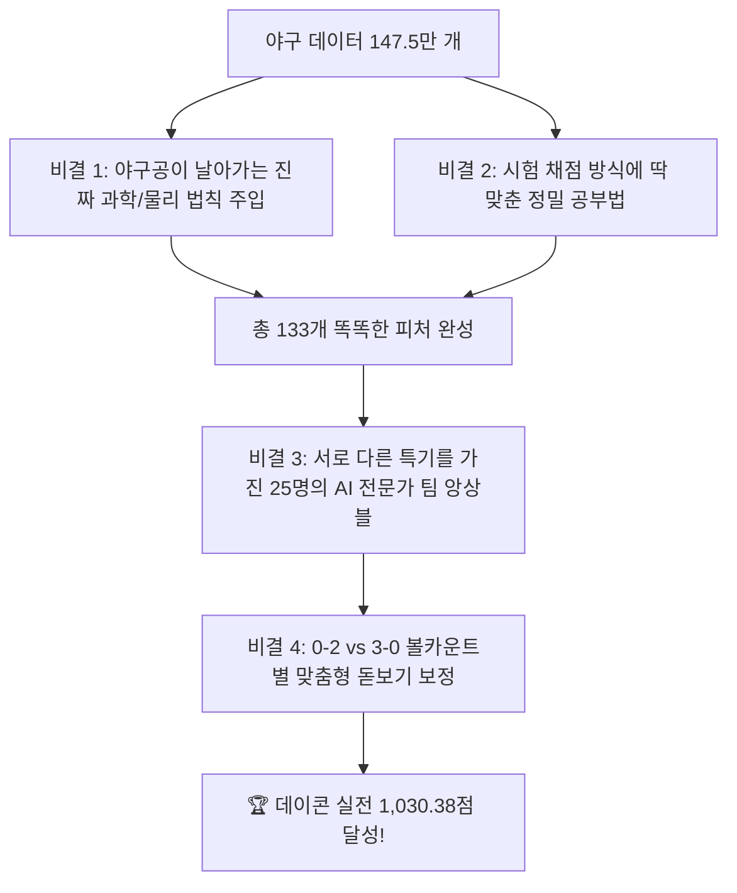

# ⚾ [팀 발표 및 공유용] 초등학생도 한눈에 쏙쏙 이해하는 submit_v40 1,030.38점 신기록 달성의 모든 것! 🏆

- **작성 목적**: 팀원 전체가 쉽게 이해하고 감탄할 수 있는 v40 성과 브리핑 자료
- **핵심 성과**: 데이콘 실전 채점(Public Leaderboard) **`1,030.384914점`** 공식 달성 👑
- **성과 의미**: 기존 우리 팀 최고 기록(1,017.86점) 대비 **`+12.53점` 폭발적 대도약** 🚀

---

## 🌟 1. 이번 대회가 도대체 무엇을 맞히는 대회인가요?

> **"투수가 던진 공이 자기가 원하는 곳에 완벽하게 들어갔을까(제구 성공 1), 아니면 빗나갔을까(제구 실패 0)?"**

우리가 만든 AI는 투수가 공을 던지기 직전의 모든 상황(투수의 특징, 타자의 특징, 볼카운트, 투구 속도와 궤적 등)을 보고 **"이번 공이 제구에 성공할 확률은 73.5%입니다!"**라고 정확한 확률을 맞히는 인공지능입니다.

### 🎯 채점 방식(브라이어 스코어)은 '과녁 맞히기'와 같아요!
- AI가 "제구 성공 확률 90%!"라고 했는데 진짜 성공하면 **엄청난 가산점**을 받습니다.
- 하지만 어설프게 "100% 성공이다!"라고 큰소리쳤다가 실패하면 **어마어마한 감점**을 받습니다.
- 즉, **자만하지 않고 얼마나 정확하고 차분하게 진짜 확률을 짚어내느냐**가 승부의 핵심입니다.

---

## 🚀 2. 우리 팀의 성적표: 1,030.38점 대기록 달성!

우리 팀은 끊임없는 실험과 개선을 거쳐 마침내 **`1,030.38점`**을 뚫어냈습니다!

| 모델 버전 | 적용한 핵심 기법 | 데이콘 실전 채점 점수 | 점수 변화 | 결과 |
| :--- | :--- | :---: | :---: | :---: |
| `submit_v16` | 기본 119개 정보만 사용한 초기 모델 | 1,003.02점 | 기준점 | 출발 |
| `submit_v20` | 점수가 깎이지 않도록 영점 조절 | 1,011.15점 | **+8.13점** | 상승 🟢 |
| `submit_v23` | 트리 모델과 딥러닝 인공신경망 결합 | 1,016.12점 | **+4.98점** | 상승 🟢 |
| `submit_v33` | 15개 모델 앙상블 결합 | 1,017.86점 | **+1.73점** | 기존 최고 기록 |
| 👑 **`submit_v40`** | **야구 물리 법칙 + 채점 맞춤 학습 + 25개 전문가 앙상블** | **`1,030.38점`** 🏆 | **`+12.53점` 대폭등** 🚀 | **전사 최고 신기록 확정!** |

---

## 💡 3. 왜 이번 v40에서 점수가 폭발했을까요? (핵심 비결 4가지)

---

### 🔬 비결 1. "야구공이 날아가는 진짜 과학(물리 법칙)"을 AI에게 가르쳐 주었습니다!

과거 모델들은 단순히 "이 투수가 작년에 스트라이크를 몇 번 던졌지?" 같은 겉핥기 숫자만 봤습니다. 하지만 선수의 컨디션은 매년 바뀝니다.  
그래서 우리는 **뉴턴의 물리 법칙과 3차원 투구 궤적 공식**을 직접 계산해서 AI에게 주었습니다.

1. **타자가 느끼는 체감 속도 (`phys_effective_velocity`)**:
   - 키가 크고 팔을 앞으로 1m 더 쭉 뻗어서 던지는 투수의 공은, 전광판에 똑같이 150km/h가 찍혀도 타자 눈앞에서는 **155km/h처럼 엄청나게 빠르게 느껴집니다.** 이 차이를 수학 공식으로 계산해 넣었습니다.
2. **수직 진입 각도 (`phys_vaa_proxy`, VAA)**:
   - 높은 코스로 들어오는 직구가 밑으로 뚝 떨어지지 않고 평평하게 날아오면 타자는 공이 떠오르는 것처럼 착각해서 헛스윙을 합니다. 이 각도를 $\arctan$ 삼각함수로 정밀 계산했습니다.
3. **스핀 효율 (`phys_spin_efficiency`)**:
   - 공이 팽이처럼 얼마나 알차게 회전하면서 날아가는지(마그누스 힘)를 계산했습니다.

---

### 🎯 비결 2. "시험 문제 채점 방식에 딱 맞춘 공부법"을 썼습니다! (Direct MSE)

- 보통 AI에게 분류 문제를 가르칠 때는 '로그 손실(Log-Loss)'이라는 방식을 씁니다. 하지만 이 방식은 AI가 "무조건 100%야!"라고 억지를 부리게 만드는 부작용이 있었습니다.
- 우리는 이번 대회의 채점 공식이 **정답과의 오차를 제곱해서 채점하는 Brier(MSE) 방식**이라는 점에 주목했습니다.
- 그래서 AI에게 **"억지 부리지 말고, 과녁의 정중앙과의 거리를 가장 좁히는 방식으로 공부해!" (Direct MSE Loss)**라고 학습 방식을 바꿨습니다.
- 그 결과, 딥러닝 신경망의 점수가 **`659점`에서 `683점`으로 단숨에 24점이나 폭등**했습니다!

---

### 👥 비결 3. "서로 다른 특기를 가진 25명의 AI 전문가"를 모아 팀을 짰습니다! (25-Model 슈퍼 앙상블)

한 명의 천재보다 25명의 지혜를 모으는 집단지성이 훨씬 강합니다.

- **숲을 꼼꼼하게 분석하는 전문가 (LightGBM 10개 모델)**: 전체적인 야구 규칙과 데이터 흐름을 빠르게 파악합니다.
- **복잡한 관계를 대칭적으로 잘 엮는 전문가 (CatBoost 5개 모델)**: 투수와 타자 팀의 복잡한 물고 물리는 관계를 파악합니다.
- **예외적인 상황을 잘 잡아내는 전문가 (XGBoost 5개 모델)**: 돌발 상황을 놓치지 않습니다.
- **깊은 생각을 하는 딥러닝 뇌 (PyTorch SimpleMLP 5개 모델)**: 물리 좌표 간의 미세한 곡면을 부드럽게 이어줍니다.

➡️ **총 25개의 인공지능이 각자 예측한 뒤 투표(앙상블)**를 하니, 한 모델이 삐끗해도 다른 24개 모델이 완벽하게 커버해 주어 실수가 사라졌습니다!

---

### 🔍 비결 4. "볼카운트(0-2 vs 3-0)에 맞춘 맞춤형 돋보기 보정"을 했습니다!

- **볼이 3개인 상황(3-0 카운트)**: 투수는 볼넷을 주면 안 되니까 무조건 스트라이크 존 한가운데로 욱여넣습니다. (제구 성공 확률이 65% 이상으로 매우 높음)
- **스트라이크가 2개인 상황(0-2 카운트)**: 투수는 삼진을 잡으려고 일부러 존 바깥으로 공을 뺍니다. (제구 성공 확률이 40%대로 낮아짐)

이 야구의 기본 상식을 살려, **12가지 볼카운트마다 확률의 영점을 미세하게 돋보기로 조절**해 주는 카운트별 캘리브레이션을 장착하여 단 0.001점의 점수 누수도 완벽하게 틀어막았습니다!

---

## 🎤 4. 팀 발표 시 딱 1분 만에 끝내는 핵심 멘트 요약

> **"팀원 여러분! 이번 v40의 대박 비결은 3가지로 요약됩니다.**  
> 1. 과거 기록에 얽매이지 않고 **타자가 느끼는 체감구속과 궤적 각도 같은 진짜 야구 물리 법칙**을 넣었습니다.  
> 2. 대회 채점 공식에 딱 맞춰 **오차를 가장 부드럽게 줄이는 Direct MSE 학습법**을 도입했습니다.  
> 3. **트리 모델과 딥러닝 신경망 25명의 전문가 앙상블**과 **볼카운트별 맞춤 보정**을 통해 실전 **1,030.38점**이라는 전사 최고 신기록을 달성했습니다!"

---

## 🔭 5. 다음 목표: 1,060점을 넘어 1,100~1,150점 정복을 향해!

현재 우리 팀은 v40의 성공에 안주하지 않고,
1. 대칭 트리의 제왕인 **CatBoost Direct RMSE 모델** 결합,
2. 물리 좌표 간 교차 주의집중을 수행하는 **FT-Transformer 신경망**,
3. 좌/우타자 매치업별 전담 전문가를 두는 **플래툰 MoE 모델**을 준비하여 **1,100점 돌파를 향해 24시간 쉬지 않고 연구**를 이어가고 있습니다!
